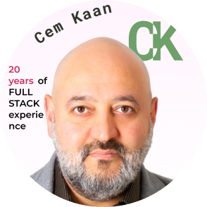

# Re-Beginners Method

Back to Basics of Coding with ...

## 20 Years of Coding Professionally

I am 47 years old  software developer from Turkiye :tr:  I build web applications for 20 years :floppy_disk:
But last 5 years, I have noticed there were strange technological developments in javascript :unamused: I started to see some codes around which did not make any sense to me :older_man: It was clear I was missing some details.

So I decided to start over from beginning :man_technologist: I've **re-learned** everything about javascript. I prepared this course to share my experience in this re-learning process. :world_map: <FontIcon icon="route" size="23" color="Crimson"/>

## For Whom Was This Course Is Prepeared?

Check if this course for you before you start climbing  :mount_fuji:

Did you try to self-teach programming from _free youtube videos_, but you couldn't seem to stick with it? Do you think that something is missing? Then, how about re-learning it step-by-step? Whatever you think you already know can be fast-forwarded with this step-by-step approach.

**JavaScript for re-beginners** is for young software students, who wants to have a strong background and interested in a complete javascript guide.

I want to share my 20 years of expertise to build a strong fundamental background your your software development career.  

## Step-by-step Approuch

I believe understanding how languages works is important. That's why I spend so much time on organizing this course.
It's intended for programmers who have been working with JavaScript at a beginner level and are now ready for a more sophisticated relationship with the language. JavaScript is a surprisingly powerful but most misunderstood language.
May be you had some coding lessons previously but feeling like you’ve missed some basics.
This step-by-step approuch is probably for you.
I will explain low-level fundamentals first, and then build on those to more
advanced and higher-level concepts

Once you learn syntax of JavaScript which is similar to Java language, you will be able to learn  Typescript which is a strict data typing extension of javascript.
Next you can even learn some modern languages like Dart and Kotlin which has similar syntax too.

**It may take time to get used to my accent but you will learn to code for real!**
